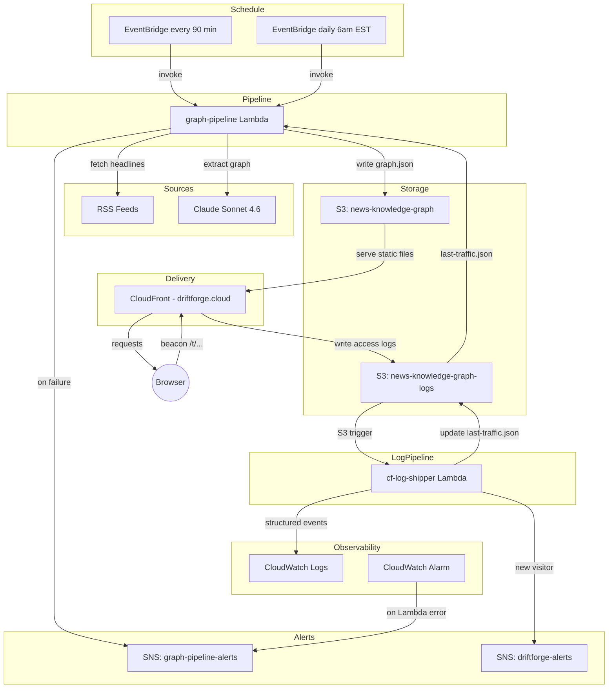

# Architecture

```mermaid
flowchart TD
    subgraph Sources
        RSS[RSS Feeds]
        Claude[Claude Sonnet 4.6]
    end

    subgraph Pipeline
        PL[graph-pipeline Lambda]
    end

    subgraph Schedule
        E1[EventBridge every 90 min]
        E2[EventBridge daily 6am EST]
    end

    subgraph Storage
        S3Main[S3: news-knowledge-graph]
        S3Logs[S3: news-knowledge-graph-logs]
    end

    subgraph Delivery
        CF[CloudFront - driftforge.cloud]
    end

    subgraph LogPipeline
        LS[cf-log-shipper Lambda]
    end

    subgraph Observability
        CW[CloudWatch Logs]
        CWA[CloudWatch Alarm]
    end

    subgraph Alerts
        SNS1[SNS: graph-pipeline-alerts]
        SNS2[SNS: driftforge-alerts]
    end

    Browser((Browser))

    E1 -->|invoke| PL
    E2 -->|invoke| PL
    PL -->|fetch headlines| RSS
    PL -->|extract graph| Claude
    PL -->|write graph.json| S3Main
    PL -->|on failure| SNS1
    CWA -->|on Lambda error| SNS1

    S3Main -->|serve static files| CF
    CF -->|write access logs| S3Logs
    S3Logs -->|S3 trigger| LS
    LS -->|structured events| CW
    LS -->|new visitor| SNS2
    LS -->|update last-traffic.json| S3Logs

    S3Logs -->|last-traffic.json| PL
    CF -->|requests| Browser
    Browser -->|beacon /t/...| CF
```
